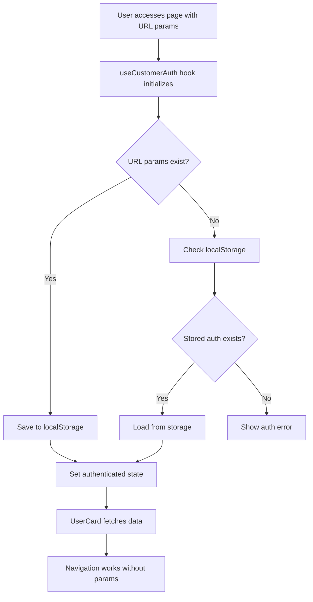

# Customer Authentication Solution

## Problem Solved

The UserCard component and user-facing pages were losing `customerID` and `apiKey` parameters when users navigated between tabs (Home, History, Offers, Support), causing authentication errors.

## Solution Overview

Implemented a persistent customer authentication system using localStorage that maintains authentication state across navigation without requiring URL parameters on every page.

## Implementation

### 1. Customer Authentication Hook (`src/hooks/useCustomerAuth.js`)

```javascript
export const useCustomerAuth = () => {
  // Manages customer authentication state
  // - Reads from URL parameters on first load
  // - Persists to localStorage for cross-navigation
  // - Provides methods to update/clear authentication
};
```

**Features:**

- **Auto-initialization** from URL parameters or localStorage
- **Persistent storage** using localStorage
- **State management** for customerID, apiKey, and customer data
- **Helper methods** for authentication management

### 2. Updated UserCard Component (`src/components/User-Facing/UserCard.jsx`)

**Before:**

```javascript
// Read URL parameters every time
const queryParams = new URLSearchParams(window.location.search);
const customerID = queryParams.get("customerID");
const apiKey = queryParams.get("apiKey");
```

**After:**

```javascript
// Use persistent authentication hook
const { customerID, apiKey, isAuthenticated, updateCustomerData } =
  useCustomerAuth();
```

**Benefits:**

- Works across all navigation
- No dependency on URL parameters after initial load
- Stores customer data for better performance
- Enhanced error handling

### 3. Enhanced UserLayout Navigation (`src/pages/user-facing-pages/UserLayout.jsx`)

**Features:**

- **Authentication check** before navigation
- **URL parameter preservation** for bookmarking/sharing
- **Route-based active page detection**
- **Authentication error screen** for unauthenticated users

**Navigation flow:**

1. User clicks navigation tab
2. System checks authentication status
3. If authenticated, navigates with optional URL parameters
4. If not authenticated, shows error message

### 4. Demo Page (`src/pages/user-facing-pages/AuthDemo.jsx`)

Testing interface with:

- **Demo login options** for different tiers
- **Custom credential input**
- **Authentication status display**
- **Live UserCard preview**
- **Navigation testing instructions**

## Usage

### For Developers

1. **Initial Access** - Use URL with parameters:

   ```
   http://localhost:3000/user/dashboard?customerID=CUST123&apiKey=API_KEY
   ```

2. **Navigation** - After initial authentication, all navigation works automatically:

   - Click Home, History, Offers, Support tabs
   - UserCard component works on all pages
   - No need to pass parameters again

3. **Testing** - Use the demo page:
   ```
   http://localhost:3000/auth-demo
   ```

### For Client Integration

```javascript
// Option 1: Direct URL with parameters
window.location.href = `/user/dashboard?customerID=${customerId}&apiKey=${apiKey}`;

// Option 2: Programmatic authentication
import { useCustomerAuth } from "./hooks/useCustomerAuth";

const { setAuth } = useCustomerAuth();
setAuth(customerId, apiKey);
```

## File Structure

```
src/
├── hooks/
│   └── useCustomerAuth.js           # Authentication hook
├── components/User-Facing/
│   ├── UserCard.jsx                 # Updated to use auth hook
│   └── themes/tierThemes.js         # Tier-based themes
├── pages/user-facing-pages/
│   ├── UserLayout.jsx               # Updated navigation
│   ├── AuthDemo.jsx                 # Testing interface
│   ├── DashboardUser.jsx            # Uses UserCard
│   ├── UserOffers.jsx               # Other user pages
│   └── ...
└── routes/
    └── Router.jsx                   # Route configuration
```

## Authentication Flow



## Error Handling

### No Authentication

- **UserCard**: Shows clear error message with instructions
- **UserLayout**: Shows authentication required screen
- **Navigation**: Disabled until authenticated

### API Errors

- **UserCard**: Shows error with retry option
- **Data**: Graceful fallback to stored customer data
- **Theme**: Falls back to Bronze tier theme

## Benefits

✅ **Persistent Authentication** - Works across all navigation  
✅ **Better UX** - No need to include URL parameters in every link  
✅ **Bookmarking Support** - Initial URLs still work with parameters  
✅ **Error Resilience** - Clear error messages and fallbacks  
✅ **Performance** - Cached customer data reduces API calls  
✅ **Tier Themes** - Dynamic styling based on customer tier  
✅ **Developer Friendly** - Easy testing and integration

## Testing

1. **Access demo page**: `http://localhost:3000/auth-demo`
2. **Login with demo credentials** for different tiers
3. **Navigate to user dashboard**: `http://localhost:3000/user/dashboard`
4. **Test navigation** using bottom tabs
5. **Verify UserCard** works on all pages

## Migration

Existing integrations will continue to work:

- URL parameters are still supported
- Authentication is automatically persisted
- No breaking changes to existing functionality

The solution is backward compatible and enhances the existing system without disrupting current workflows.
